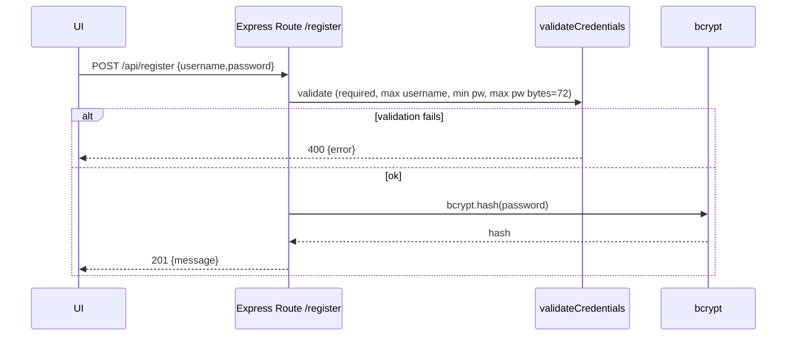
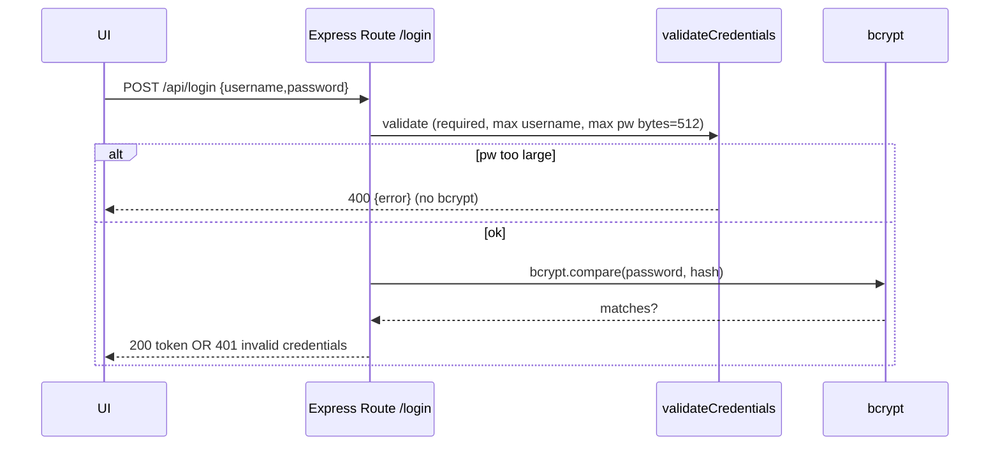

# Design: EPMCDMETST-67287 — Enforce max password bytes (bcrypt 72) on auth

Repo: https://github.com/harshalwarkar2020/watch-web-app  
Plan source: `plan-1.md`  
Impacted areas:
- Backend: `backend/src/middleware/validateCredentials.js`, `backend/src/routes/auth.js`
- Frontend: `frontend/src/hooks/useCredentialsForm.js`
- Tests (per plan): backend Jest + frontend Vitest
- Docs (per plan): `docs/api.md` or `README.md`

## 1) Intake & Goal Framing

### Objective
Password validation currently enforces only a minimum length and measures length in UTF‑16 code units, while **bcrypt only uses the first 72 bytes** of the password. This can lead to silent truncation and ambiguous credentials, and very large passwords can create unnecessary compute load.

This change introduces:
- **Registration:** enforce **max password length in UTF‑8 bytes = 72**
- **Login:** fail fast for oversized passwords (before calling bcrypt) using a safer cap (**512 UTF‑8 bytes**, product decision provided)
- **Username:** enforce max username length (**30 characters**, product decision provided)
- **Client-side mirroring** of the same constraints to improve UX
- Tests and docs updates

### Stakeholders / Audience
- Backend + frontend engineers
- QA
- Security reviewers

### Explicit decisions provided by user
- Registration max password: **72 UTF‑8 bytes**
- Login oversize cap: **512 UTF‑8 bytes** (return 400 before bcrypt)
- Username max length: **30 characters**
- Error format: **HTTP 400** with JSON `{ error: "..." }`
- Publish target: create a new design doc file (do not overwrite `design.md`)

### Success criteria
- Prevent bcrypt silent truncation during registration
- Prevent hashing/comparing huge inputs on login (DoS/compute safety)
- Keep API behavior predictable with consistent 400 error shape
- Keep frontend and backend validation aligned

---

## 2) Architecture Document

### 2.1 System Context (relevant slice)
- Frontend calls backend auth endpoints:
  - `POST /api/register`
  - `POST /api/login`
  - `GET /api/me`
- Backend uses Express routes (`backend/src/routes/auth.js`)
- Credential validation middleware is `validateCredentials.js`
- Password hashing/compare uses `bcrypt`

### 2.2 Component Responsibilities
**Frontend**
- Collect username/password
- Validate locally for:
  - required fields
  - username length <= 30 characters
  - password byte length caps (register <= 72, login <= 512)
- Show friendly validation error prior to API call

**Backend**
- `validateCredentials` middleware:
  - required checks (already exists)
  - min password length for registration (already exists via `minPasswordLength: 8`)
  - new: username max length (30 chars)
  - new: password max byte length checks (UTF‑8 bytes)
- `auth.js` routes:
  - registration: enforce strict bcrypt-safe max (72 bytes) before hashing
  - login: reject oversized passwords (512 bytes) before bcrypt.compare()

### 2.3 Architecture Diagram (Mermaid)

```mermaid
flowchart LR
  UI[Frontend Forms\n(useCredentialsForm)] -->|POST /api/register| API[Express Backend\n/routes/auth.js]
  UI -->|POST /api/login| API
  API --> VC[validateCredentials middleware]
  VC -->|valid| AUTH[Auth handlers]
  AUTH -->|bcrypt.hash / bcrypt.compare| BCRYPT[bcrypt]
  AUTH --> UI
  VC -->|400 {error}| UI
```

### 2.4 Key Data/Control Flows

#### Registration flow (max 72 bytes)
1. Frontend validates username <= 30 chars and password UTF‑8 bytes <= 72
2. Backend middleware validates again
3. Backend performs `bcrypt.hash(password)`
4. Store `password_hash`

#### Login flow (fail fast at 512 bytes)
1. Frontend validates username <= 30 chars and password UTF‑8 bytes <= 512
2. Backend checks again and returns **400** if exceeded **before bcrypt.compare**
3. Otherwise proceed with normal login compare

### 2.5 Non-functional considerations
- **Security:** avoid ambiguous/truncated passwords for newly registered users
- **Performance:** avoid expensive bcrypt on huge payloads
- **Consistency:** backend is source of truth; frontend mirrors rules for UX

---

## 3) High-Level Design (HLD)

### 3.1 Validation Rules (Source of Truth)
| Field | Context | Rule | Measurement |
|---|---|---|---|
| username | register + login | required; trimmed non-empty; max length = 30 | **characters** |
| password | register | required; min length = 8 (existing); **max = 72 bytes** | **UTF‑8 bytes** |
| password | login | required; **max = 512 bytes** (fail-fast) | **UTF‑8 bytes** |

> Note: Registration max is strict due to bcrypt 72-byte behavior; login cap is higher to avoid locking out existing users while still preventing large inputs.

### 3.2 API Behavior
- Validation failures return **HTTP 400** with JSON:
  - `{ error: "<message>" }`
- Invalid credentials remain **401** with `{ error: "invalid credentials" }` (existing behavior)

### 3.3 Proposed Backend Changes (HLD)
- Enhance `validateCredentials` middleware:
  - add `maxUsernameLength` and `maxPasswordBytes` (or separate options for login/register)
  - compute byte length via UTF‑8 encoding
- Apply middleware configuration:
  - `/register`: `{ minPasswordLength: 8, maxPasswordBytes: 72, maxUsernameLength: 30 }`
  - `/login`: `{ maxPasswordBytes: 512, maxUsernameLength: 30 }`

### 3.4 Proposed Frontend Changes (HLD)
Update `useCredentialsForm.js` to include:
- username max length check (30 chars)
- password byte-length validation:
  - register form should enforce 72
  - login form should enforce 512
Because `useCredentialsForm` is shared, pass validation constraints/config based on the form using it.

### 3.5 Risks / Tradeoffs
- **UTF‑16 vs UTF‑8 mismatch:** must explicitly use UTF‑8 byte measurement on both FE/BE
- **Login cap correctness:** 512 is a product decision; large enough to avoid lockout, small enough to prevent compute abuse
- **Error messaging:** keep messages stable for tests and UX

---

## 4) Low-Level Design (LLD)

### 4.1 Backend LLD

#### 4.1.1 New/Updated Middleware API
`validateCredentials(options)` currently supports `{ minPasswordLength }`.

Extend to (backwards compatible):
```js
validateCredentials({
  minPasswordLength?: number,
  maxPasswordBytes?: number,
  maxUsernameLength?: number,
})
```

#### 4.1.2 UTF‑8 Byte Length Utility
Implement a helper inside middleware (or a small util module if preferred later):

```js
function utf8ByteLength(str) {
  return Buffer.byteLength(str, 'utf8'); // Node.js backend
}
```

#### 4.1.3 Middleware Decision Logic
Order of checks (fail fast, consistent messages):
1. username required and non-empty after trim
2. password required and non-empty
3. username max length (30 chars)
4. password min length (register only, existing)
5. password max UTF‑8 bytes:
   - register: 72
   - login: 512

Response contract for any of the above:
- `return res.status(400).json({ error: "<message>" })`

**Suggested error messages** (keep concise; can be asserted in tests):
- required: `"username and password are required"` (existing)
- username too long: `"username must be at most 30 characters"`
- password too short: `"password must be at least 8 characters"` (existing format)
- password too long (register): `"password must be at most 72 bytes"`
- password too long (login): `"password must be at most 512 bytes"`

> Messages are proposed for design clarity; if you have preferred exact wording, tests/docs should match.

#### 4.1.4 Route Wiring (auth.js)
Update route middleware usage:

- `POST /register`
  - `validateCredentials({ minPasswordLength: 8, maxPasswordBytes: 72, maxUsernameLength: 30 })`
- `POST /login`
  - `validateCredentials({ maxPasswordBytes: 512, maxUsernameLength: 30 })`

This ensures oversized login passwords return **400 before bcrypt.compare**.

#### 4.1.5 Sequence Diagrams

**Register**


**Login (fail-fast 512 bytes)**


---

### 4.2 Frontend LLD

#### 4.2.1 Validation constraints injection
`useCredentialsForm(submitFn)` is shared by login/register. Extend signature to accept constraints:

```js
useCredentialsForm(submitFn, {
  maxUsernameLength = 30,
  maxPasswordBytes, // 72 for register, 512 for login
})
```

#### 4.2.2 UTF‑8 byte length in browser
Use `TextEncoder`:

```js
const bytes = new TextEncoder().encode(password).length
```

#### 4.2.3 Frontend validation order
1. required fields
2. username length <= 30 chars
3. password bytes <= configured max (72 or 512)
4. call `submitFn`

Error displayed via existing `message/isError`.

---

## 5) Testing & Documentation (Design-Level)

### 5.1 Backend Jest tests (per plan)
Add/extend tests to cover:
- register rejects password >72 UTF‑8 bytes
- login rejects password >512 UTF‑8 bytes (and does not call bcrypt.compare — can be asserted via mocking)
- username >30 chars rejected for both routes
- existing min password length still enforced on register

### 5.2 Frontend Vitest tests (per plan)
Add tests around `useCredentialsForm` validation:
- username length boundary
- password byte-length boundary using multi-byte chars to ensure UTF‑8 measurement

### 5.3 Docs
Update README.md or docs/api.md to document:
- username max 30 chars
- register password: 8+ chars and <=72 UTF‑8 bytes
- login password: must be <=512 UTF‑8 bytes (fail-fast protection)
