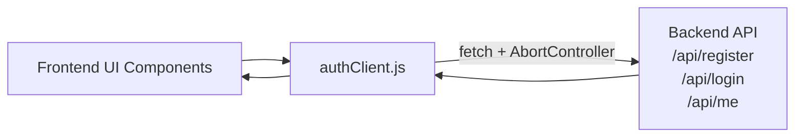
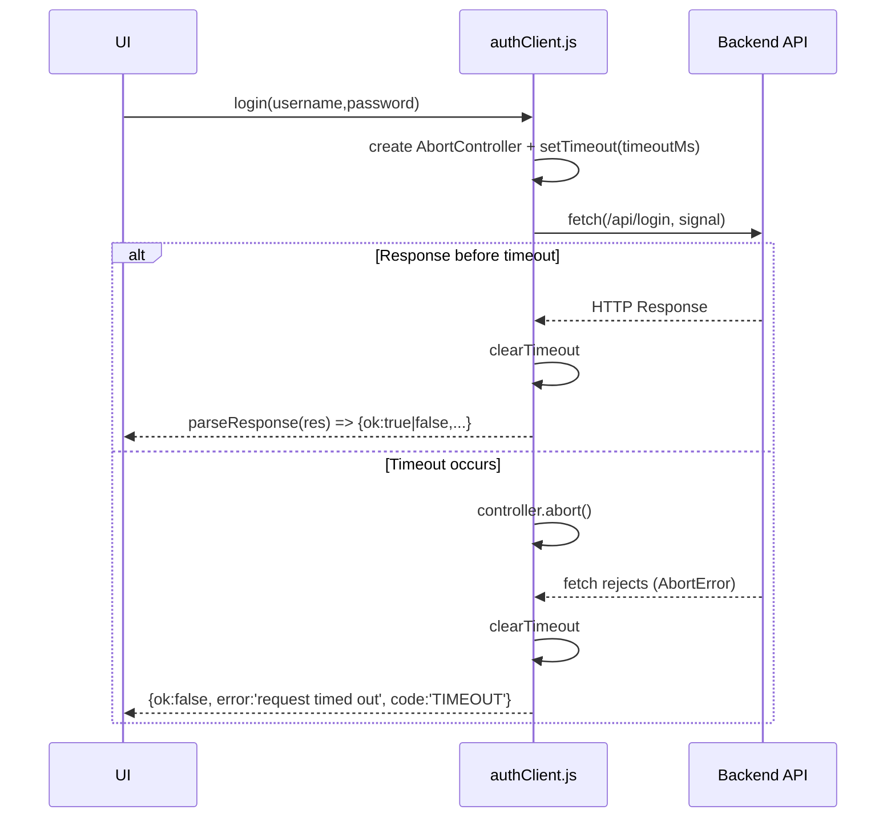

# Design: EPMLCDMETST-66781 — AbortController timeout for authClient calls

Repo: https://github.com/harshalwarkar2020/watch-web-app  
Plan source: `plan.md`  
Impacted file: `frontend/src/api/authClient.js`

## 1. Intake & Goal Framing

### Goal
Add **fast-fail timeout handling** for frontend auth API calls in `frontend/src/api/authClient.js` using `AbortController` so that:
- `register`, `login`, `me` do not hang indefinitely on slow/stuck requests
- timeouts return a predictable, normalized response shape
- no unhandled promise rejections occur for timeouts

### Scope
**In scope**
- Add timeout enforcement to:
  - `register(username, password)`
  - `login(username, password)`
  - `me(token)`
- Provide a configurable timeout (default in the 8–10s range)
- Normalize timeout failure to:
  - `{ ok: false, error: 'request timed out', code: 'TIMEOUT' }`

**Out of scope**
- Backend changes
- UI changes
- Introducing new HTTP libraries (e.g., Axios)

### Stakeholders / Audience
- Frontend developers maintaining API client utilities
- QA validating timeout behavior and error shapes

### Constraints (from Plan)
- Use native `fetch`
- Must use `AbortController`
- Must avoid unhandled promise rejections
- Normalized timeout shape is as specified above

### Success Criteria / Acceptance Criteria Mapping
| AC | Requirement | Design response |
|---:|---|---|
| 1 | All API calls enforce a timeout (configurable; default ~8–10s) | Add shared `fetchWithTimeout(url, options, { timeoutMs })` and apply to all 3 calls; set default (assumption: 9000ms) |
| 2 | On timeout resolve to normalized `{ ok:false, error:'request timed out', code:'TIMEOUT' }` | Catch abort errors and return the normalized shape |
| 3 | No unhandled promise rejection occurs for timeouts | Ensure `clearTimeout()` always runs; ensure abort-triggered fetch rejection is caught and converted to normalized response |

### Assumptions (explicit)
- Default timeout will be **9000ms** unless you specify 8000ms or 10000ms.
- Current `parseResponse(res)` remains the standard parser for non-timeout responses.
- Existing non-timeout errors (network errors, JSON parsing issues) are not fully standardized by the ticket; we will not expand normalization beyond timeout unless requested.

---

## 2. Architecture Document

### 2.1 Logical Architecture (relevant slice)
The change is localized to the **frontend API client layer**.

- **UI / pages/components** call auth API functions
- **authClient.js** performs HTTP calls using native `fetch`
- **Backend API** responds to `/api/register`, `/api/login`, `/api/me`

### 2.2 Component Responsibilities
- **UI Layer**
  - Calls `register/login/me`
  - Renders based on `{ ok, data }` or `{ ok:false, error, code? }`
- **Auth Client (`frontend/src/api/authClient.js`)**
  - Constructs requests
  - Applies timeout using `AbortController`
  - Normalizes timeout failure to `{ ok:false, error:'request timed out', code:'TIMEOUT' }`
  - Parses successful/failed HTTP responses via `parseResponse`
- **Backend API**
  - Provides auth endpoints (not modified)

### 2.3 Architecture Diagram (Mermaid)



### 2.4 Runtime Data Flow (timeout path)
1. UI calls `login(username, password)`
2. `authClient` starts timer (`setTimeout`)
3. Timer triggers abort: `controller.abort()`
4. `fetch` rejects with an abort-related error
5. `authClient` catches it and returns:
   - `{ ok: false, error: 'request timed out', code: 'TIMEOUT' }`
6. UI receives resolved value (not thrown), avoiding unhandled rejections

### 2.5 Key Non-Functional Requirements (NFRs)
- **Reliability:** calls terminate deterministically within configured timeout
- **Predictability:** timeout responses share a stable error shape
- **Safety:** avoid leaking timers/controllers; avoid unhandled promise rejections

---

## 3. High-Level Design (HLD)

### 3.1 Proposed Design
Introduce a small internal utility function in `authClient.js`:

- `fetchWithTimeout(url, options, { timeoutMs })`
  - creates an `AbortController`
  - attaches `signal` to `fetch`
  - aborts after `timeoutMs` via `setTimeout`
  - clears timer in `finally`
  - on abort/timeout, returns normalized timeout response (resolved value)

Then update:
- `register`, `login`, `me` to use `fetchWithTimeout` and `parseResponse`.

### 3.2 Configuration
- Default timeout constant:
  - `DEFAULT_TIMEOUT_MS = 9000` (assumption from Plan range 8–10s)
- Optional per-call override:
  - Allow passing `{ timeoutMs }` internally (or via optional parameter) if needed later.

### 3.3 Error Handling Strategy (HLD)
- **Timeout / Abort**: return `{ ok:false, error:'request timed out', code:'TIMEOUT' }`
- **HTTP non-2xx**: keep existing `parseResponse` behavior:
  - `{ ok:false, error: data.error || 'request failed' }`
- **JSON parse failures**: existing behavior returns `{}` for data and uses fallback `'request failed'`
- **Other fetch failures (network/DNS)**: not specified by ticket; keep behavior minimal (either throw or normalize). Preferred: normalize to `{ ok:false, error:'request failed' }` to align with current pattern (see LLD for recommended handling).

### 3.4 Trade-offs / Risks
- **AbortController support**: modern browsers supported; if legacy browsers are targeted, may need polyfill (not in scope).
- **Abort reason detection**: browsers differ (`AbortError`, `DOMException`, message text). Must detect robustly.
- **Semantics**: An abort can happen for reasons other than timeout if reused; ensure controller is per-request.

---

## 4. Low-Level Design (LLD)

### 4.1 Updated Module Structure (`frontend/src/api/authClient.js`)

#### Constants
- `BASE_URL = import.meta.env.VITE_API_BASE_URL || 'http://localhost:3000'`
- `DEFAULT_TIMEOUT_MS = 9000` (assumption; adjust if needed)

#### Functions
1. `parseResponse(res)`
   - unchanged
2. `isAbortError(err)`
   - helper to identify abort errors robustly
3. `fetchWithTimeout(url, options, timeoutMs = DEFAULT_TIMEOUT_MS)`
   - performs fetch with `AbortController`
   - returns either:
     - `Response` (on success) OR
     - a normalized timeout object (on timeout)
4. `register/login/me`
   - call `fetchWithTimeout`
   - if result is a normalized timeout object -> return it
   - else `parseResponse(response)`

### 4.2 Detailed Pseudocode

```js
const DEFAULT_TIMEOUT_MS = 9000;

function isAbortError(err) {
  return err?.name === 'AbortError'
      || err instanceof DOMException && err.name === 'AbortError';
}

async function fetchWithTimeout(url, options = {}, timeoutMs = DEFAULT_TIMEOUT_MS) {
  const controller = new AbortController();
  const id = setTimeout(() => controller.abort(), timeoutMs);

  try {
    const res = await fetch(url, { ...options, signal: controller.signal });
    return res;
  } catch (err) {
    if (isAbortError(err)) {
      return { ok: false, error: 'request timed out', code: 'TIMEOUT' };
    }
    // recommended minimal normalization to keep callers consistent:
    return { ok: false, error: 'request failed' };
  } finally {
    clearTimeout(id);
  }
}

export async function login(username, password) {
  const result = await fetchWithTimeout(`${BASE_URL}/api/login`, {...});
  if (result?.ok === false) return result; // normalized error object
  return parseResponse(result); // Response -> normalized parse
}
```

### 4.3 Sequence Diagram (LLD)



### 4.4 Interface Contracts (Return Shapes)
All exported auth functions return a resolved Promise of:

**Success**
- `{ ok: true, data: any }`

**HTTP error (non-2xx)**
- `{ ok: false, error: string }`

**Timeout**
- `{ ok: false, error: 'request timed out', code: 'TIMEOUT' }`

> Note: Timeout is the only case with `code` mandated by Plan/AC.

### 4.5 Edge Cases
- **Timeout fired after fetch already resolved**: `finally` clears timer; late abort will not occur.
- **Slow JSON parsing**: timeout only covers the fetch request. `parseResponse` parses JSON after response arrival; not timed. (Not requested by Plan.)
- **Unhandled promise rejections**: avoided by catching abort errors and returning normalized value; timer is cleared in `finally`.

### 4.6 Test/Verification Checklist (design-level)
- Simulate a stalled network request (devtools throttling / blocked endpoint):
  - `register/login/me` resolve within ~9s
  - return `{ ok:false, error:'request timed out', code:'TIMEOUT' }`
- Confirm no console warnings for unhandled rejections during timeout.
- Confirm existing behavior for:
  - valid 200 response -> `{ ok:true, data }`
  - 401/400 -> `{ ok:false, error }` via `parseResponse`

---

## 5. Deployment / Operational Notes
- No deployment changes; frontend bundle only.
- Timeout value can be a constant; if needed later it can be driven by `import.meta.env` (not required by Plan).
